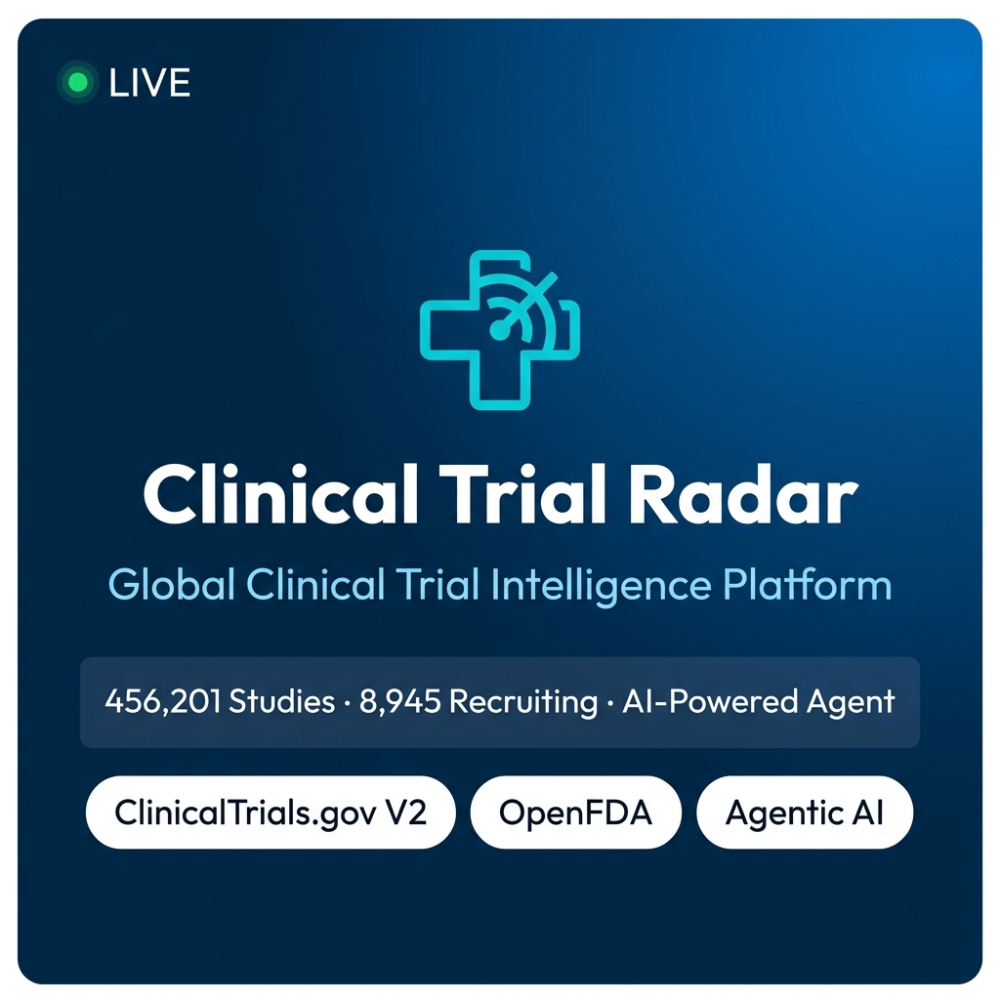

# 🔬 Clinical Trial Radar

> **Global Clinical Trial Intelligence Platform** — Live data from ClinicalTrials.gov V2 & OpenFDA, with an agentic AI layer for natural-language search, eligibility matching, and pharma analytics.



[](https://clinicaltrialradar.netlify.app)
[](https://clinicaltrials.gov)
[](https://react.dev)
[](https://vite.dev)
[](https://recharts.org)
[](https://youtu.be/lJzXiPz1eA4)
[](LICENSE)

> **🚀 Live App URL:** [https://clinicaltrialradar.netlify.app](https://clinicaltrialradar.netlify.app)
> 
> **▶️ Demo Video:** [https://youtu.be/lJzXiPz1eA4](https://youtu.be/lJzXiPz1eA4)

---

## ✨ Features

| View | Description |
|------|-------------|
| 🏠 **Dashboard** | Global KPI cards + interactive Recharts (status pie, therapeutic area bar) + live trial feed |
| 🔍 **Clinical Search** | Multi-filter search (keyword, condition, sponsor, phase, status) with trial detail modals |
| 🩺 **Eligibility Matcher** | Patient intake → scored eligibility matching (Eligible / Partial / Ineligible) with per-criterion checklists |
| 💊 **OpenFDA Drug Search** | Live FDA label lookup + side-by-side drug comparison table |
| 🏢 **Company Insights** | Type-ahead company search + 3 interactive charts (timeline, status pie, phases bar) |
| 🤖 **Trial Radar AI** | Natural-language agentic chat with real-time reasoning steps + inline dynamic widgets |

---

## 🚀 Quick Start

```bash
# Clone the repository
git clone https://github.com/saurabhdas2/ClinicalTrialRadar.git
cd ClinicalTrialRadar

# Install dependencies (Node 18+ required)
npm install

# Start development server
npm run dev

# Open in browser
open http://localhost:5173
```

> **No API keys required.** Both ClinicalTrials.gov V2 and OpenFDA are fully public APIs.

---

## 🧠 Agentic Design

The **Trial Radar AI Agent** (`src/services/agentEngine.js`) understands 5 intent classes from plain English:

```
"Find active breast cancer trials by Novartis"          → trial_search
"Am I eligible for Alzheimer's trials at age 68?"       → eligibility_check
"Compare side effects of Advil and Tylenol"             → drug_compare
"Search FDA label for Keytruda"                         → drug_search
"Show pipeline metrics for AstraZeneca"                 → company_insights
```

Each query triggers:
1. **Intent parsing** — keyword extraction, entity recognition
2. **Multi-step reasoning** — streamed step-by-step log in the UI
3. **Live data fetch** — ClinicalTrials.gov V2 or OpenFDA
4. **Dynamic widget rendering** — trial cards, eligibility grids, drug tables, company charts — inline in the chat thread

---

## 🏗️ Architecture

```
src/
├── App.jsx                          # Sidebar navigation + view routing
├── index.css                        # Design token system (OpenFDA-inspired)
├── agents/                          # Formal Agentic AI Layer
│   ├── orchestrator.js              # Master ReAct Orchestrator Agent
│   ├── eligibilityAgent.js          # Specialized Eligibility Matcher sub-agent
│   ├── agentMemory.js               # Stateful session-scoped memory
│   └── toolRegistry.js              # Typed tool schemas (9 registered tools)
├── services/
│   ├── mockData.js                  # 10 real trials + 5 FDA drugs + 6 company timelines
│   ├── apiService.js                # ClinicalTrials.gov V2 + OpenFDA with dynamic endpoints
│   └── agentEngine.js               # Public backward-compatibility facade
├── components/
│   └── TrialDetailsModal.jsx        # Shared reusable trial detail modal
└── views/
    ├── Dashboard.jsx                 # KPI hero + 2 Recharts + live feed
    ├── TrialSearch.jsx              # Multi-filter + card grid + modal
    ├── EligibilityMatcher.jsx       # Intake form + scoring engine
    ├── DrugSearch.jsx               # FDA search + details panel + comparator
    ├── CompanyInsights.jsx          # Type-ahead + 3 Recharts + phase table
    └── AgentPanel.jsx               # Chat UI + reasoning steps + inline widgets
```

### 🧠 Agentic Flow Diagram

```
                                  User Query
                                      │
                                      ▼
                                ┌───────────┐
                                │ Memory    │ ◄─── Session context loaded
                                └─────┬─────┘
                                      │
                                      ▼
                        ┌───────────────────────────┐
                        │    Orchestrator Agent     │ ◄─── Perceives & Classifies Intent
                        │  (agents/orchestrator.js) │
                        └─────────────┬─────────────┘
                                      │
                         Builds plan, pipes inputs to:
                                      │
        ┌─────────────────────────────┼─────────────────────────────┐
        ▼                             ▼                             ▼
  ┌──────────────┐             ┌──────────────┐              ┌──────────────┐
  │ TrialSearch  │             │ Eligibility  │              │ Drug/Company │
  │  Sub-Agent   │             │  Sub-Agent   │              │  Sub-Agent   │
  └──────┬───────┘             └──────┬───────┘              └──────┬───────┘
         │                            │                             │
         └────────────────────────────┼─────────────────────────────┘
                                      │
                                      ▼
                          ┌───────────────────────┐
                          │     Tool Registry     │ ◄─── Validates schema & inputs
                          │ (agents/toolRegistry.js)│
                          └───────────┬───────────┘
                                      │
                 Invokes matching executing tool function:
                                      │
        ┌─────────────────────────────┼─────────────────────────────┐
        ▼                             ▼                             ▼
 ┌──────────────┐              ┌──────────────┐              ┌──────────────┐
 │ ClinicalTrials│             │   OpenFDA    │              │ Eligibility  │
 │  Search API  │              │  Label API   │              │ Scoring Engine│
 └──────────────┘              └──────────────┘              └──────────────┘
```

---

## 📊 Data Sources

| Source | Endpoint | Content |
|--------|----------|---------|
| [ClinicalTrials.gov V2](https://clinicaltrials.gov/data-api/api) | `/api/v2/studies` | 456,000+ global clinical trials |
| [OpenFDA Drug Labels](https://open.fda.gov/apis/drug/label/) | `/drug/label.json` | FDA-approved drug labels, warnings, side effects |

Both APIs are **publicly available with no authentication**. The app includes a high-fidelity mock dataset as an automatic fallback when APIs are slow or rate-limited.

---

## 🎨 Design System

Inspired by the [openFDA](https://open.fda.gov) brand identity:

- **Primary**: `#0071bc` (OpenFDA blue)
- **Navy**: `#002b49` (Sidebar / hero backgrounds)
- **Success**: `#10b981` (Eligible / active)
- **Warning**: `#f59e0b` (Partial / pending)
- **Danger**: `#ef4444` (Ineligible / terminated)
- **Fonts**: Inter + Outfit (Google Fonts)
- **Charts**: Recharts with custom color palette and interactive tooltips
- **Animations**: `fadeInUp` card entrances, `translateY` hover lifts, spinning loaders

---

## 🛠️ Tech Stack

| Layer | Technology |
|-------|-----------|
| Framework | React 19 + Vite 8 |
| Charts | Recharts |
| Icons | Lucide React |
| Styling | Vanilla CSS with CSS custom properties |
| APIs | ClinicalTrials.gov V2 + OpenFDA (public) |
| AI Layer | Client-side NLP engine (no LLM API needed) |

---

## 📁 Key Files

- [`src/services/agentEngine.js`](src/services/agentEngine.js) — Agentic NLP + eligibility scoring
- [`src/services/apiService.js`](src/services/apiService.js) — ClinicalTrials.gov + OpenFDA integration
- [`src/services/mockData.js`](src/services/mockData.js) — Curated demo dataset
- [`src/index.css`](src/index.css) — Full design token system
- [`KAGGLE_SUBMISSION.md`](KAGGLE_SUBMISSION.md) — Kaggle submission writeup
- [`public/demo_video.mp4`](public/demo_video.mp4) — Demo video ([YouTube](https://youtu.be/lJzXiPz1eA4))

---

## 📄 License

MIT © 2026 — Data from ClinicalTrials.gov and OpenFDA is public domain.
